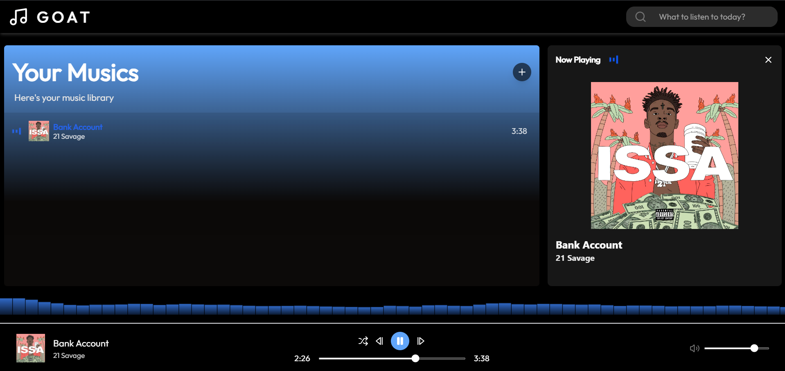
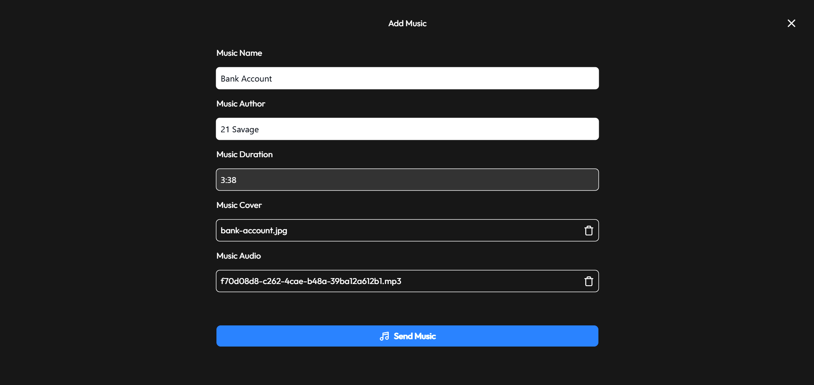
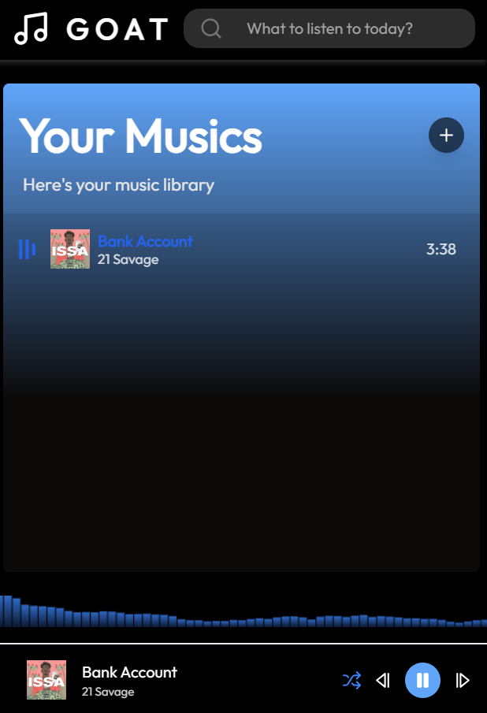
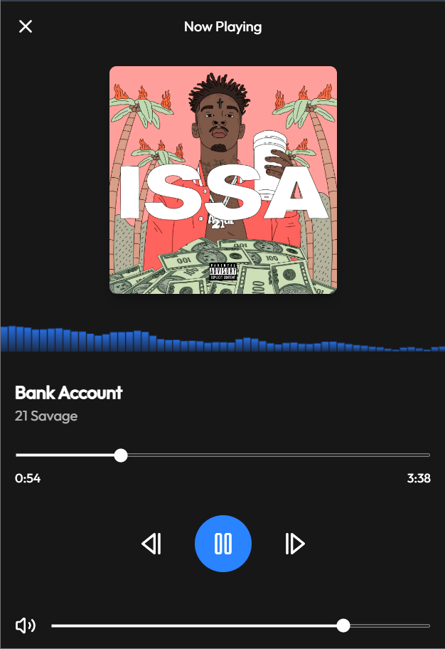

<div align="center">

|  | <h1 align="center">Goat Music</h1> |
|----------------------------------------------------------------------------|:---------------------------------:|

---

</div>

<div>


</div>

## 📋 About The Project

Goat Music is a music streaming web application developed with React, TypeScript and Tailwind CSS. The project offers a modern and responsive interface, connecting the frontend with a backend that stores and manages music files and images.

The application is designed to be simple and efficient, with a focus on a fluid user experience. It allows you to upload files, such as songs and album covers, and provides control over music playback, as well as generating dynamic visualizations of sound waves.

### 👁️ Preview

---

<div style='display: flex;  flex-direction: column; align-items: center; justify-content: center;' align='center'>

<div style='display: flex;  flex-direction: column; align-items: center; gap: 17px'>

 &nbsp;
 &nbsp;

</div>

<div style='display: flex;  flex-direction: row; align-items: center; justify-content: center; gap: 6px' align='center'>

 &nbsp;
 &nbsp;

</div>

</div>

## 🚀 Features

- Clean Interface
- Responsive Layout
- Sound Waves According to the Rhythm of the Music
- File upload and storage:
  - Images (e.g., album covers)
  - Music Files (e.g., songs, audio recordings)
- Music Filter
- Music Randomizer
- Music Volume Controller

## 🛠️ Dependency

> [!IMPORTANT]  
> To run this project you need a basic server to storage your files **[Goat Music Server](https://github.com/RenanTheFato/GoatMusicServer)**

## 💻 Installation

### 1. Clone the repository
```bash
git clone https://github.com/RenanTheFato/GoatMusic.git
cd GoatMusic
```

### 2. Install the dependencies
```bash
npm install
```

### 3. Set the environment variables

> .env.example  ──> .env

### 4. Scripts available

```bash
# Development
npm run dev

# Build
npm run build

# Production Preview
npm run preview
```
## 📁 Project Structure

```
GoatMusic/
├──public/
|    └── icon.svg
├── src/
|    ├──@types/
│    |    └── types.ts
|    ├──components/
│    │   ├── AddMusics.tsx
│    │   ├── MiniWaves.tsx
│    │   └── MobilePlayer.tsx
|    ├──service/
│    │   └── api.ts
|    ├── App.tsx
|    ├── index.css
|    ├── main.tsx
|    ├── vite-env.d.ts
├── .env-example
├── .gitignore
├── eslint.config.js
├── index.html
├── LICENSE
├── package-lock.json
├── package.json
├── postcss.config.js
├── README.md
├── tailwind.config.js
├── tsconfig.app.json
├── tsconfig.json
├── tsconfig.node.json
└── vite.config.ts
```

## 📄 License

This project is under the MIT license. See the [LICENSE](LICENSE) file for more details.

## 👥 Contribution

### Share the project


## 📧 Contact

Renan - [GitHub](https://github.com/RenanTheFato)

Email - <a href="mailto:renan.santana007@hotmail.com">renan.santana007@hotmail.com</a>

Project Link: [https://github.com/RenanTheFato/GoatMusic](https://github.com/RenanTheFato/GoatMusic)
